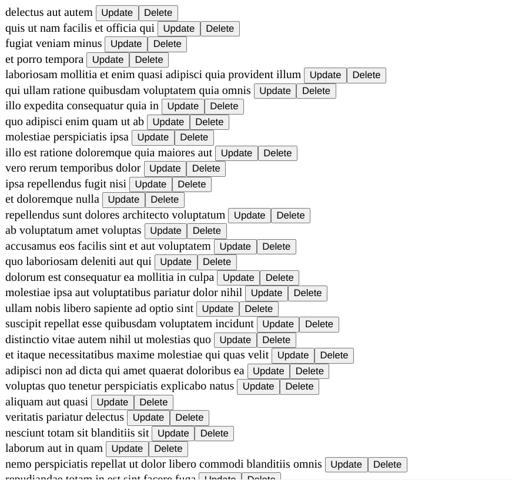
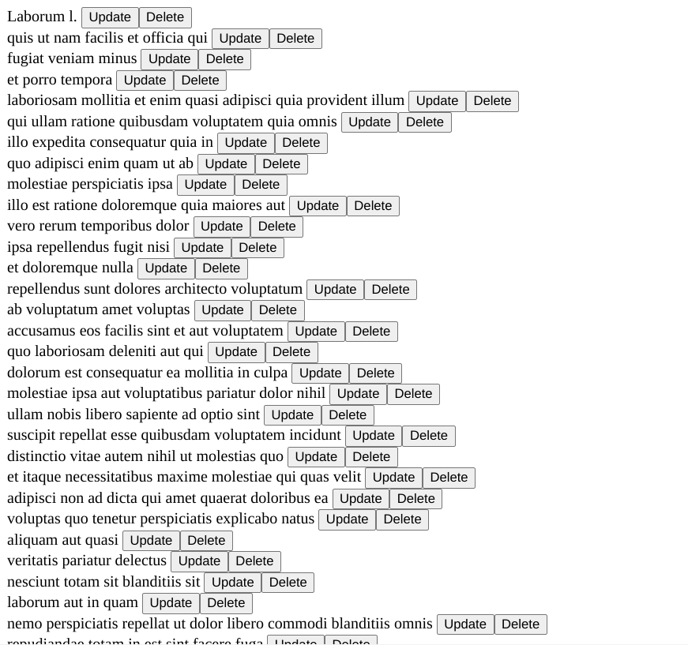
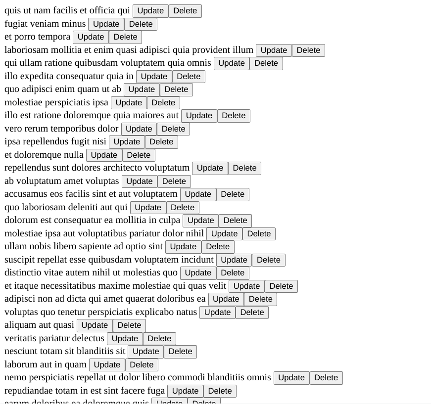

# Crud App Local Store

[Angular Challenges](https://github.com/tomalaforge/angular-challenges) #5 (crud) solution.

## Screenshots


***



***



***



***

## Directions

### Information

Communicating and having a global/local state in sync with your backend is the heart of any application. You will need to master those following best practices to build strong and reliable Angular Application.

### Statement

In this exercise, you have a small CRUD application, which get a list of TODOS, update and delete some todo.

Currently we have a working example but filled with lots of bad practices.

### Step 1: refactor with best practices

What you will need to do:

- Avoid **any** as a type. Using Interface to leverage Typescript type system prevent errors
- Use a **separate service** for all your http calls and use a **BehaviourSubject** for your todoList
- Use **AsyncPipe** to suscribe to your todo list. _(Let you handle subscription, unsuscription and refresh of the page when data has changed)_, avoir manual subscribe when it's not needed
- Don't **mutate** data

```typescript
// Avoid this
this.todos[todoUpdated.id - 1] = todoUpdated;

// Prefer something like this, but need to be improved because we still want the same order
this.todos = [...this.todos.filter((t) => t.id !== todoUpdated.id), todoUpdated];
```

- Use **ChangeDectection.OnPush**

### Step 2: Improve

- Add a **Delete** button: _<a href="https://jsonplaceholder.typicode.com/" target="_blank">Doc of fake API</a>_
- Handle **errors** correctly. _(Globally)_
- Add a Global **loading** indicator. _You can use MatProgressSpinnerModule_

### Step 3: Maintainability!! add some test

- Add 2/3 tests

### Step 4: Awesomeness!!! master your state.

- Use the **component store of ngrx** as a local state of your component. _(or any other 3rd Party lib)_
- Have a **localize** Loading/Error indicator, e.g. only on the Todo being processed and **disable** all buttons of the processed Todo. _(Hint: you will need to create an ItemComponent)_

## Built With

- [Angular CLI](https://github.com/angular/angular-cli) version 16.2.0.
- [Angular](https://angular.io)

## Thoughts

- There are no actions in a component store implemenation.
- It is not worth adding Angular Material for a spinner.  All you need is a simple component and a simple css animation.
- You can get a loading spinner from [loading.io](https://loading.io/css/).   
- OnPush works by comparing references of the inputs of the component.  If you do not provide a reference to a new object and instead mutate an existing one, the OnPush change detector will not get triggered.  To keep your ui in sync with state, you need to create new objects.  
- @ngneat/falso - optimization bailout error - need to add "seedrandom" to allowedCommonJsDependencies array in angular.json's build options to suppress the error.
- OnStateInit & OnStoreInit seem unnecessary.  Useful for toggling loading states? Niche? 
- If you have to bring in a service in the constructor to use effects, why not just pass initial state to super() ?  
- If you inject the service, then you need OnStateInit & OnStoreInit ? 
- I had problems rendering the todos in the template.  I thought using *ngIf was the problem (getting object Object) so I switched to *ngrxLet but really, it was my initial store configuration.  
- LetModule is now LetDirective.  Need to import LetDirective to use *ngrxLet.
- *ngrxLet directive will create an embedded view when an observable emits a value, regardless of whether it is truthy or falsy. It handles the zero problem. (Zero is a falsy value so it is difficult to conditionally render something when a successful api request returns nothing) 
- I think *ngrxLet implementation is unnecessary in this implementation.  The api will never return 0 todos and to have zero todos rendered in the html a user would need to delete 200 todos.   
- Adding *ngrxLet is not free since you need to add another dependency - @ngrx/component.  
- In Thomas's solution, he uses a switchMap and {debounce: true}.  switchMap is needed to unsubscribe to many clicks of the update button and deliver the last randText() call.  
- Seems like randText() call is synchronous.
- I had a little confusion why debounce was used.  The debounce pertains to the state and not the buttons in the html.  
- If you don't use debounce, your stream will emit everytime a new value is patched to your state.   
- "If you add a new value to todos and loading at the same time, viewmodel will emit twice, but with debounce, it will only emit once because we wait that the state is settled."  
- I used a simplified callState with just a string - versus an enum with various states and a separate errorState.
- I used a global spinner that renders when callState is "loading" - used toLowerCase on callState in the html.  
- A todo item component would require a separate component store with update and delete methods.  The app store would not have those methods.  
- I think it is possible to have a todo-item component without adding a component store to it.  You would need to add {providedIn: 'root'} to app store injectable decorator and then inject the store in the todo item component.  This approach makes the store like a service.  [See this video for a hybrid approach](https://www.youtube.com/watch?v=EBQE5drdBuE).
- Not a lot of great learning material out there on testing ngrx stores.
- Thomas' solution doesn't have tests and other solutions don't either.
- Once again, I think ngrx has had a lot of changes that are not really reflected in the documentation out there. 
- Can't really show individual loading when the todos are being fetched -> you can show loading when deleting and updating actions are performed.
- Instead of disabling buttons `[disabled]='vm.callState === 'Updating' '`, just removed the todo and the buttons from the html by conditional rendering them.  
- Both stores have callState properties -> can show spinner when loading the todos and then show status of update / delete actions in the TodoItemComponent
- Where you put `fixture.detectChanges` matters and moving the call to it could make a failing test pass. 
- The previous todoItem html made testing more difficult.  I changed the html and it ended up more like the original directions requirements.    
- Most likely, you will have to activate slow mode in devtools to actually see the buttons disable.  
- The todo title disappears when updating / deleting.  It would be preferrable to have it stay until either action completes.  
- I pretty much got the application tested.  Some tests are definitely not ideal but I am working off limited documentation and few practical examples I can follow.
- The TodoItemStore.vm$ observable is readonly so it is saved to a different variable in the todo-item component so you can override it in the todo item test.  

## Need to change angular.json to suppress a commonjs warning caused by a dependency in the @ngneat/falso package

```json
      "architect": {
        "build": {
          "builder": "@angular-devkit/build-angular:browser",
          "options": {
            "allowedCommonJsDependencies":[
              "seedrandom"
            ],
          }
        }
```

## Continued Development

- Better test isolation
- Typescript improvements -> problems from conditional logic -> todo might be undefined, etc.

## Useful Resources

- [Medium](https://medium.com/@thomas.laforge/discover-the-power-of-ngrx-component-store-to-create-a-local-component-state-53e3a0af7970) - thomas laforge solution
- [YouTube](https://www.youtube.com/watch?v=qRAhe06UhM4) - Keeping Side Effects out of your Angular Components with NgRx ComponentStore
- [YouTube](https://www.youtube.com/watch?v=xPmtsD5LRqQ) - How to use NgRx ComponentStore? - Alex Okrushko | NG-DE 2022
- [loading.io](https://loading.io/css/) - css loading spinners
- [Angular University](https://blog.angular-university.io/onpush-change-detection-how-it-works/) - onpush change detection how it works
- [Bobby Hadz](https://bobbyhadz.com/blog/angular-commonjs-or-amd-dependencies-can-cause-optimization-bailouts#:~:text=The%20Angular%20warning%20%22CommonJS%20or,json%20file.) - angular commonjs or amd dependencies can cause optimization bailouts
- [Blog](https://medium.com/ngconf/using-ngrx-component-store-introduction-7787ce250edc) - ngrx component store introduction
- [YouTube](https://www.youtube.com/watch?v=r0Rzt4lQ0T0) - Angular State Management Tutorial with NgRx Component Store
- [LogRocket](https://blog.logrocket.com/types-vs-interfaces-typescript/#:~:text=In%20summary%2C%20interfaces%20will%20detect,type%20aliases%20should%20be%20used.) - types vs interfaces
- [Stack Blitz](https://stackblitz.com/edit/angular-behaviorsubject-todo?file=app%2Fchild%2Fchild.component.ts) - angular behavior subject
- [indepth dev](https://indepth.dev/posts/1408/how-to-manage-angular-state-in-your-components) - manage angular state in your components
- [indepth dev](https://indepth.dev/posts/1171/angular-viewmodel-as-observable) - angular viewmodel as observable
- [indepth dev](https://indepth.dev/posts/1372/ngrx-component-store-debouncing) - component store debouncing
- [dev.to](https://dev.to/ngrx/announcing-ngrx-v14-action-groups-componentstore-lifecycle-hooks-eslint-package-revamped-ngrx-component-and-more-18ck) - ngrx v14 update
- [dev.to](https://dev.to/this-is-angular/removing-boilerplate-code-in-ngrx-component-store-1f83) - removing boilerplate code
- [dev.to](https://dev.to/ngrx/building-reactive-angular-templates-with-ngrx-component-4m1e) - reactive angular templates
- [dev.to](https://dev.to/nickraphael/with-the-ngrxlet-directive-we-could-get-rid-of-that-ngif-trick-that-we-lovehated-20m4) - ngrxlet directive
- [Stack Overflow](https://stackoverflow.com/questions/50605327/how-to-mock-spy-an-imported-function-in-angular-unit-testing) - mock spy an imported function
- [YouTube](https://www.youtube.com/watch?v=DCw-JBll2u0) - Angular 2022Q3. Workshop: NgRx. Unit tests.
- [Angular University](https://blog.angular-university.io/rxjs-higher-order-mapping/) - rxjs higher order mapping
- [Medium](https://medium.com/@rogerg93/how-to-unit-test-the-ngrx-component-store-in-angular-3ad395a21cbd) - how to unit test the ngrx component store
- [Github](https://github.com/ngrx/platform/discussions/3335) - RFC: Add "ngrxOnInitStore" lifecycle method to ComponentStore #3335
- [Stack Overflow](https://stackoverflow.com/questions/61446014/observablevoid-doesnt-invoke-the-subscriber) - observable void doesn't invoke the subscriber
- [Github](https://github.com/ngrx/platform/issues/2991) - not initialized store if using constructor
- [Stack Overflow](https://stackoverflow.com/questions/74105159/getting-ng-rx-component-store-error-mystore-has-not-been-initialized-yet-when) - getting ng rx component store not initialized error
- [Github](https://github.com/ngxs/store/issues/640) - need to mutate state when using patchState 
- [Stack Overflow](https://stackoverflow.com/questions/35328652/angular-pass-callback-function-to-child-component-as-input-similar-to-angularjs) - angular pass callback function to child component as input
- [Stack Overflow](https://stackoverflow.com/questions/36654834/angular2-unit-test-with-input) - unit test with input
- [Stack Overflow](https://stackoverflow.com/questions/42656045/angular2-testing-and-resolved-data-how-to-test-ngoninit) - testing ngOnInit
- [Stack Overflow](https://stackoverflow.com/questions/50137734/detectchanges-not-working-within-angular-test) - detect changes 
- [Stack Overflow](https://stackoverflow.com/questions/52332314/unit-test-angular-input-set-function-not-triggered) - unit test input set function not triggered
- [Stack Overflow](https://stackoverflow.com/questions/52111750/angular-testing-an-input-with-a-set-attached-to-it) - angular testing an input with a set attached to it
- [Stack Overflow](https://stackoverflow.com/questions/49288024/how-to-mock-ngrx-selector-in-a-component) - mock ngrx selector in a component
- [Stack Overflow](https://stackoverflow.com/questions/53850889/cant-find-button-inside-a-ngif-statement-while-testing-because-statement-invol) - can't find button inside ngIf statement
- [Stack Overflow](https://stackoverflow.com/questions/43111905/override-read-only-object-within-a-jasmine-unit-test) - override read only object within a jasmine unit test